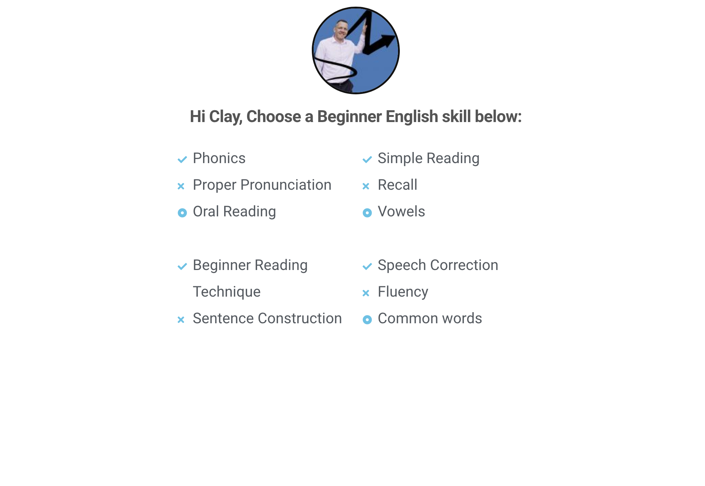
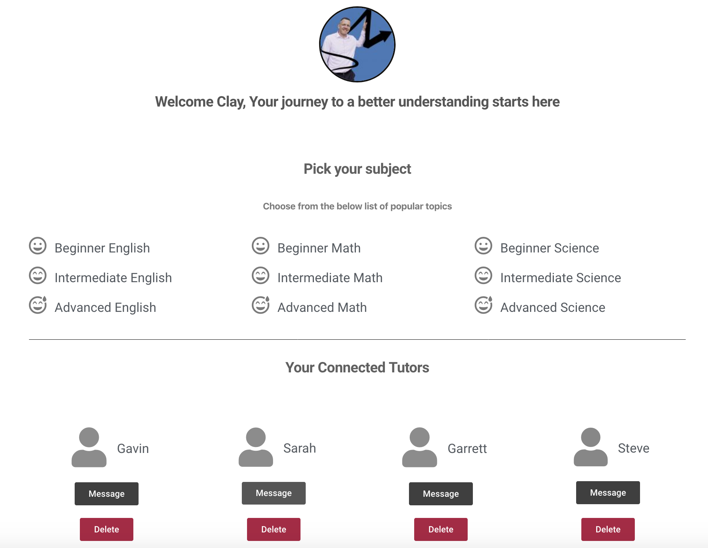
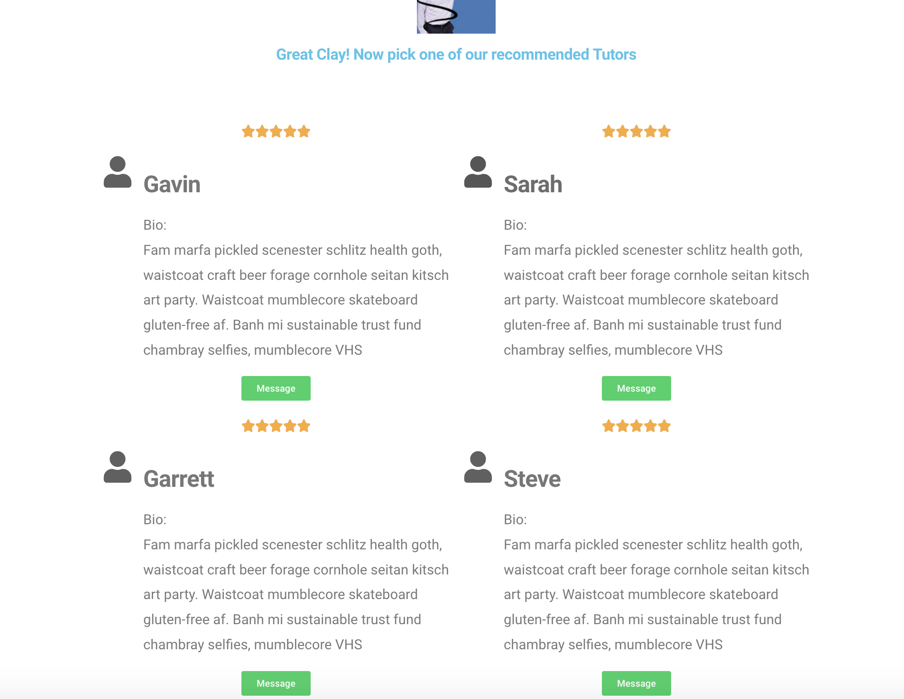

# STUDER-UNIT 3-GA

Studer is the cross-section of students and tutors merged into one resourceful app. It is designed, developed, and deployed as a full-stack React Web Application from 3 General Assembly Software Engineering Immersive students in Seattle, Wa.

## Team Members

* Clay Darland
* Garrison Highsmith
* Josh Hunter

## Foundation

We built Studer with React.js, Node.js, Express, and MongoDB. It incorporates API Axios fetches, CSS Materialize libraries, MERN stacks, CRUD methods, and RESTful routing best practices.


## User Experience, wireframing, project flow

We agreed that the most useful application would allow a student or tutor to 
* Login
* State their role 
* Enter their personal dashboard as the main activity hub
* Declare their school level, subject category and name
* Edit their profile with a brief bio and image upload
* Post a message to their dashboard
* Generate a favorite list of tutors and update as desired

We began with some initial whiteboard rendering that captured the user flow


And then finished the brainstorming session with these following Trello wireframes:





As a team we decided to utilize Trello as a workflow development tool to keep communication, updates, and roles clearly defined throughout the project.

## MongoDB Model Schemas
### User Model
```
const userSchema = new mongoose.Schema({
  name: {
    type: String,
    required: [true, 'You must enter a name'],
    minlength: [1, 'Name must be between 1 and 99 characters'],
    maxlength: [99, 'Name must be between 1 and 99 characters']
  },
  password: {
    type: String,
    required: [true, 'You must enter a password'],
    minlength: [8, 'Password must be between 8 and 128 characters'],
    maxlength: [128, 'Password must be between 8 and 128 characters'],
  },
  email: {
    type: String,
    required: [true, 'You must enter an email'],
    minlength: [5, 'Email must be between 5 and 99 characters'],
    maxlength: [99, 'Email must be between 5 and 99 characters']

  },
  
  username: String,
  role: String,
  bio: String,
  subjects: [],
  messages: [messageSchema],
  tutors: []
});
```
### Message Model (embedded Schema)
```
const messageSchema = new mongoose.Schema ({
    senderId: String,
    recipientId: String,
    title: String,
    body: String,
});
```
### Subject Model
```
const subjectSchema = new mongoose.Schema ({
    schoolLevel: String,
    category: String,
    subject: String
});
```
### Tutor Model
```
const tutorSchema = new mongoose.Schema ({
    name: String,
    id: String
})
```

## Development Update
#### Day 1
We began brainstorming as a group and initially voted on hardcoding a quiz that the user takes and then posts as a result to them and their tutor.  Our plans evolved from that original thought into a student/tutor login with subject match and messaging capability. This took some recalculating and rerendering of wireframes, but ultimately led to a better, more thorough start to finish user story.

### Day 2
We built the model schemas and ensured that data was flowing from databases to postman. Rendering content onto pages.

### Day 3
We began work on the edit profile page, continued work on messaging capability, refactored subject rendering, and reflected all subjects onto user's pages.

### Day 4


